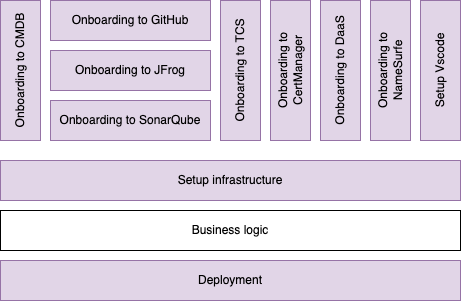

# k8s-service-deployment
## Service deployment flow


----------

[View the diagram on Confluence](https://itwiki.atlassian.teliacompany.net/pages/viewpage.action?pageId=1006637679#EngineeringJourney-ServiceDeploymentFlow)

----------

## Dependencies
The following secrets must be created in the repository:

* DAAS_LOKI_PASSWORD - DaaS Loki Password for Grafana Integration
* DAAS_LOKI_USERNAME - DaaS Loki username for Grafana Integration
* KUBE - Kube config for Kubernetes deployments
* TELIA_ACME_KEY - Certificate details for Cert Manager Integration
* TELIA_ACME_KEY_ID - ACME account ID for Cert Manager Integration.
* ARTIFACTORY_READER_USERNAME_P - JFrog project specific artifactory username
* ARTIFACTORY_READER_PASSWORD_P - JFrog project specific artifactory password
* SONAR_TOKEN - Sonarqube token for Sonarqube Integration

```
#!/bin/bash

REPO="telia-cloud-platform/devexp-k8s-service-ent"
ARTIFACTORY_READER_USERNAME_P="username"
ARTIFACTORY_READER_PASSWORD_P="password"

gh secret set "ARTIFACTORY_READER_USERNAME_P" --repo "$REPO" --body "$ARTIFACTORY_READER_USERNAME_P"
gh secret set "ARTIFACTORY_READER_PASSWORD_P" --repo "$REPO" --body "$ARTIFACTORY_READER_PASSWORD_P"
```


The following secrets will be used in cicd however already pre-created on organization level
* ARTIFACTORY_READER_PASSWORD - JFrog common artifactory repositories account password
* ARTIFACTORY_READER_USERNAME - JFrog common artifactory repositories account username
* SONARQUBE_SCANNER - Sonarqube token for Sonarqube Integration

